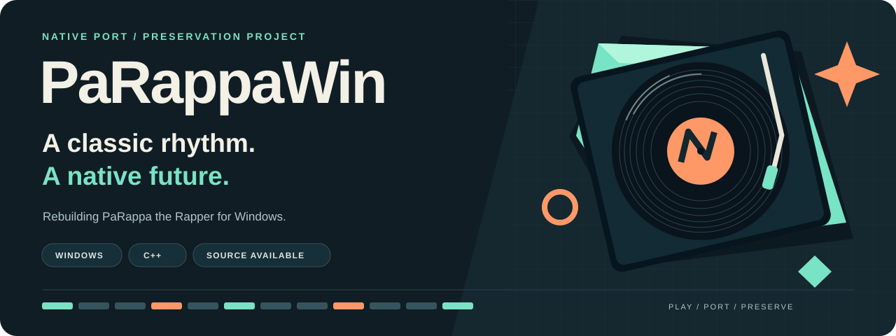

<p align="center">
  
</p>

<p align="center">
  <strong>English</strong> · <a href="README.zh-CN.md">简体中文</a><br>
  <a href="#watch-it-run">Watch the demo</a> · <a href="BUILDING.md">Build</a> · <a href="STATUS.md">Status</a> · <a href="ROADMAP.md">Roadmap</a> · <a href="CONTRIBUTING.md">Contribute</a>
</p>

**PaRappaWin** brings *PaRappa the Rapper* (PSX) into a native Windows runtime through a port of the original program's behavior—not an embedded emulator. This repository publishes the current full-build source snapshot, including Windows-specific additions.

**经典节奏，原生新生。** 面向 Windows 的原生移植与保存项目；[中文首页](README.zh-CN.md) · [中文进度](PROGRESS.zh-CN.md)。

<table>
<tr>
<td width="33%" valign="top"><strong>01 / NATIVE</strong><br><br>Windows entrypoint, rendering, media, audio and input in the port's own runtime.</td>
<td width="33%" valign="top"><strong>02 / PRESERVE</strong><br><br>Original behavior is the reference. Publishing source is a milestone, not a claim of perfect parity.</td>
<td width="33%" valign="top"><strong>03 / BUILD</strong><br><br>Current product source and both build entrypoints are public. Bring your own lawful game data to run it.</td>
</tr>
</table>

## Watch it run

<p align="center">
  <a href="https://www.youtube.com/watch?v=jLRAnNM8XWU">
    
  </a><br>
  <strong><a href="https://www.youtube.com/watch?v=jLRAnNM8XWU">▶ Stage 1 · Chinese localization demo</a></strong><br>
  <sub>Native PaRappaWin Windows footage—not emulator footage. An existing demonstration, not a new acceptance test for the current HEAD.</sub>
</p>

## The checkpoint, at a glance

**Source snapshot: 2026-09-08 · [c43ef46](https://github.com/2320614999/PaRappaWin-public/commit/c43ef463090d1c549143f45616bbf7d4321a42c5)**

| 439 source / header / table files | 153 product C++ translation units | 2 build entrypoints |
| :---: | :---: | :---: |
| Published snapshot inventory | Full PowerShell compile + link recorded | `build.ps1` + `CMakeLists.txt` |

These are figures from the [publication record](BUILDING.md), not live CI badges. The recorded build used MSVC 14.44.35207 x64 and Windows SDK 10.0.19041.0. CMake and all source tests are **not** claimed as verified by that record.

| Area | What the current record supports |
| :--- | :--- |
| **Source & Windows additions** | Current full-build source is public; platform-specific features are retained. |
| **S0 / SS0 / Stage1** | Implementations are included; behavior parity is still incomplete. |
| **Stage1 movie skip** | Cross-skip ended video, subtitles and movie audio via injected PAD input. Physical-controller verification remains open. |
| **Return → LOAD → high scores → progression** | **Blocked.** Same-process return reaches directory resource loading, then stalls on lower CD completion feedback. Earlier isolated save/readback observations do not close this loop. |
| **Stage2 and later** | Existing scaffolding is included; these are **not completed ports**. |

> [!IMPORTANT]
> **Buildable source ≠ a finished game.** This development round remains paused at the maintainer's request. The homepage refresh does not resume implementation, change runtime code, or add build/gameplay results. [Status & evidence](STATUS.md) · [Resumption criteria](ROADMAP.md)

## Build on Windows

Use 64-bit Windows, Visual Studio 2022 C++ x64 build tools, a Windows 10/11 SDK, and PowerShell 5.1 or later. From the repository root:

```powershell
powershell -NoProfile -ExecutionPolicy Bypass -File build.ps1
```

The default is a **full rebuild**; do not use `-Fast` for verification. Close this checkout's game before building and do not run it or tests concurrently with compilation.

**Output:** `build/product/PaRappaWin.exe`, copied to `bin/PaRappaWin.exe`.

Compilation does not require a disc image or private research workspace. Running the executable requires game data from your own lawful copy; it is not a self-contained game distribution. Toolchain overrides and the CMake alternative are in [BUILDING.md](BUILDING.md).

## Explore the project

| Start here | Go deeper |
| :--- | :--- |
| [中文进度](PROGRESS.zh-CN.md) · [English progress](PROGRESS.en-US.md) | [Status & validation scope](STATUS.md) · [Roadmap](ROADMAP.md) |
| [Full-build guide](BUILDING.md) · [Contribution guide](CONTRIBUTING.md) | [Source inventory](PUBLIC_SYNC_FILELIST.txt) · [Windows-layer inventory](PUBLIC_WIN_LAYER_FILELIST.txt) |
| [Report a reproducible issue](https://github.com/2320614999/PaRappaWin-public/issues/new/choose) | [Publication boundary](PUBLIC_BOUNDARY.md) · [Third-party notes](THIRD_PARTY.md) |

## Frequently asked

<details>
<summary><strong>Is this an emulator?</strong></summary>

No. The target is a native Windows port of the original program's behavior, not an embedded PSX emulator. The current snapshot still has documented parity gaps.

</details>

<details>
<summary><strong>Can I compile it? Can I play the entire game?</strong></summary>

The public PowerShell full-build pass is recorded in [BUILDING.md](BUILDING.md). That is not an all-tests or all-stages pass. S0/SS0 and Stage1 are present, the same-process directory return is still blocked, and Stage2+ are unfinished. No completion percentage is used as a substitute for end-to-end verification.

</details>

<details>
<summary><strong>Does this repository include the game data?</strong></summary>

It is not a complete game-data distribution. Supply your own lawful runtime data. The public boundary retains previously published subtitles, mappings, project-authored PR2 rail textures and pre-existing embedded boot-logo byte headers; this refresh adds no extracted game media. Those third-party bytes are not licensed as project-owned artwork. Read [PUBLIC_BOUNDARY.md](PUBLIC_BOUNDARY.md), [THIRD_PARTY.md](THIRD_PARTY.md) and [NOTICE](NOTICE).

</details>

<details>
<summary><strong>What is the most useful next implementation step?</strong></summary>

After an explicit resumption decision: fix the Stage1 return path's lower-CD completion feedback, then verify return, LOAD, high scores and progression in the **same process**. A new process reading an existing card is not a substitute. See [ROADMAP.md](ROADMAP.md).

</details>

<details>
<summary><strong>How can I help?</strong></summary>

Reproducible bug reports, documentation corrections and narrowly scoped patches are useful. English and Chinese are welcome. Include the commit and what you actually tested, redact personal data, and never attach game dumps or personal save cards. Start with [CONTRIBUTING.md](CONTRIBUTING.md). The existence of submission templates does not announce a development restart or promise a review timeline.

</details>

---

**License & publication boundary.** Original project-owned materials use [Apache-2.0](LICENSE). This does not grant rights to third-party game data, names, trademarks, audio, video or artwork. The public repository has separate history; private research, credentials, configuration and personal cards remain outside this publication. [NOTICE](NOTICE) · [THIRD_PARTY.md](THIRD_PARTY.md) · [PUBLIC_BOUNDARY.md](PUBLIC_BOUNDARY.md).

<sub>The header is original decorative project artwork, not a game screenshot or an official game cover. [Presentation assets](.github/assets/README.md)</sub>
