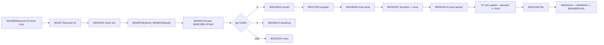

# Stage1 event4/fail prompt sprite packet plan (2026-05-10)

## 结论

P0-B 当前不能判定为 closed。`800203D4 -> 8001C550 -> 8001B590 -> 8001B25C -> 8003FA20` 的 PSX 静态链已经足够证明 event4 prompt 每帧应走 FastSprite packet/OT submit，而不是只输出三条 host draw command；但 Win 侧 `src/pr/pr_stage1_fail_prompt_direct.*` 目前只保存 prompt command carrier，没有把 local FastSprite、packet words、OT slot update、`dword_800901C8` allocator advance 接入 `PrPsxEventFrameDirect::PsxCall8001E750_Event4`。

禁止在 `pr_ui_overlay.cpp`、renderer 或 fail prompt adapter 里按表现补分支。下一步必须按 `导出 -> 画图 -> 翻译 -> 删除 -> 接线` 推进。

## 静态证据

### PSX 调用链

| 地址 | 当前证据 | 对 P0-B 的含义 |
|---|---|---|
| `8001E750` | event id `4` 先 `8004019C` 取 draw slot，`80040F90(dword_8006ED50[slot])` 设置 packet allocator，`80040CC8(..., 80087288 + 20*slot)` 清 work list；`gp+0x38C == 0` 时调用 `800203D4(*a2)`。 | prompt sprite submit 必须发生在 event frame work list/allocator owner 内，不是独立 UI draw。 |
| `800203D4` | 固定调用 `8001C550(56,57,80050950,0)`；再按 `ctx0` 选择 left/right template，坐标为 `(70,149)` 和 `(178,152)`。 | prompt 是三次 `8001C550`，模板分别来自 `80050950/60/70/80/90`，不是一张 host 菜单图。 |
| `8001C550` | 伪 C 为 `8001B590(a1,a2,a3,0,0,a4, 80087288 + 20*(gp+872))`。 | wrapper 只负责把当前 work list 传给 `8001B590`；adapter 不应在这里发明绘制语义。 |
| `8001B590` | 先把 screen x/y 转成 `x-160`、`y-120` 的 local sprite 坐标，调用 `8001B25C(local, template, 0, 0)`，随后 `GsSortFastSprite(local, work, priority)`。 | prompt 坐标必须进入 local FastSprite，再经 `8003FA20` submit；目前 `BuildDrawCommands_800203D4` 没有这层。 |
| `8001B25C` | 拷贝 template attr/width/height，并计算 `tpage/u/v/clut`；静态 disasm 未显示写 local `+0x14/+0x15/+0x16` RGB。 | RGB tail owner 仍是 gap，不能默认 host RGB 或 renderer tint。 |
| `8003FA20` | 读 local `+0x14..16` 为 RGB，写 6-word packet：link tag、draw mode、color code、XY、UV/CLUT、WH；OT slot 地址为 `4*priority + work+0x04 - 4*work+0x08`，写入 packet addr low24，allocator 前进 `0x18`。 | `pr_psx_fast_sprite_submit_direct.*` 已有 8003FA20 形状，但 event4 prompt 尚未消费该 result。 |

### Win 现状 gap

| 文件 | 已有内容 | gap |
|---|---|---|
| `src/pr/pr_stage1_fail_prompt_direct.cpp` | `PopulatePromptDraw()` 调 `PsxCall8001E750_Event4()`，再用 `BuildDrawCommands_800203D4()` 生成三条 `SpriteCommand`；dispatcher action 标为 `DirectPromptDrawWrapperGap`。 | `BuildDrawCommands_800203D4()` 是表层 carrier，不含 `8001C550/8001B590/8001B25C/8003FA20` submit result、OT slot、allocator 更新。 |
| `src/pr/pr_psx_event_frame_direct.cpp/.h` | `PsxCall8001E750_Event4()` 记录 draw slot、packet allocator、clear work list、event4 分支；`PsxCall8001EA00_EndFrame()` 记录 flip + `80040CA4 -> 800450A0 -> 80046840` carrier。 | `DrawWrapperResult8001E750` 只有 `promptSub800203D4Called` bool，没有 prompt FastSprite submit array；`800468E0` 调度语义仍未闭合。 |
| `src/pr/pr_psx_fast_sprite_submit_direct.cpp/.h` | `PsxCall8003FA20_GsSortFastSprite()` 已翻出 6-word packet、OT slot、allocator advance、runtime update helper。 | 目前主要被 movie/raw-draw 侧 bridge 消费；event4 prompt 没有复用 `BuildInputFromRuntime8003FA20/ApplyRuntimeUpdate8003FA20`。 |
| `src/pr/pr_stage1_scene1_movie1_direct.cpp` | 已有可参考的 `8001B590 -> 8001B25C -> 8003FA20` bridge，包括 local sprite 构造、submit input、runtime apply。 | 这是参考实现，不等于 event4 prompt 已闭合；不能直接把 movie runtime owner 当 event4 owner。 |

## 依赖图

## 下一步

### 1. 导出

- 导出或复核 `8001B590/8001B25C/8003FA20` 的同一份 clean 伪 C + disasm，保留 stack layout，重点标出 local sprite `+0x14/+0x15/+0x16` 是否有 caller/stack owner。
- 导出 `8001C550` 所有参数到 `8001B590` 的寄存器/栈传递图，明确 `a4` 是 priority，最后一个参数是 `80087288 + 20*(gp+872)` work list。
- 补导 `800468E0` 与 `800450A0/80046840` 的调用边界，区分 direct 可记录的调度语义和 Win HAL 真正执行的 GPU/DMA submit。
- 复核 `800203D4` 五个 template 指针 `80050950/60/70/80/90` 的 template bytes，不能只记录 host texture id。

### 2. 画图

- 画 `800203D4` 三次 prompt submit 图：`ctx0=-1/0/1` 下 title、left、right 各自的 template、坐标、priority。
- 画 `8001C550 -> 8001B590 -> 8001B25C -> 8003FA20` field map：screen x/y、local x/y、template attr/UV/CLUT、RGB tail、priority、work list。
- 画 event4 frame owner 图：`8001E750` 设置 allocator/work list，`800203D4` 写 packet/OT，`8001EA00` flip/submit，`800436F0(-1)` text flush 只消费 P0-A record bank。
- 把 RGB tail 标成 unresolved node，直到证据证明 `+0x14..16` 的来源；禁止用默认颜色把图画成已闭合。

### 3. 翻译

- 在 direct 层增加 event4 prompt 专用 submit result，形状应接近 `PrPsxFastSpriteSubmitDirect::GsSortFastSpriteResult8003FA20`，而不是继续扩大 `SpriteCommand`。
- 将 `BuildDrawCommands_800203D4()` 降级为兼容 carrier；新的 authority 应是 `800203D4` direct action：三次构造 local sprite、调用 8003FA20、累计 runtime update。
- `PrPsxEventFrameDirect::PsxCall8001E750_Event4()` 应保存 prompt submit array 和 work/allocator after-state；backdrop/reset branch 继续保持各自 packet/reset evidence。
- RGB tail 未闭合前，翻译输出必须显式带 `rgbTailGap`/`sourceUnknown`，不能把 `0,0,0` 或 renderer 默认白当 PSX 真值。

### 4. 删除

- event4 prompt packet/OT 未闭合前，不删除 `pr_ui_overlay.cpp::RenderEvent4PromptNative(...)` 或 `RenderVerticalMenu` fallback。
- `80026B94(event=4)` frame loop、prompt packet submit、text flush、DMA/HAL boundary 未同时闭合前，不删旧 event4 dispatcher/fallback。
- 删除动作只在 direct unit producer/consumer/packet 边界闭合后执行；删除目标是壳层重复逻辑，不是平台 HAL 或渲染适配层。

### 5. 接线

- `pr_scenes.cpp` fail prompt adapter 只传平台事实：pad state、vblank/HAL、GPU/DMA submit handle；不推导 prompt 绘制状态。
- event4 prompt submit 接入 `PrPsxFastSpriteSubmitDirect` 的 runtime owner，但 owner 必须来自 event4 frame `8001E750` 的 work list/allocator，不复用 movie runtime owner。
- `800436F0(-1)` record bank 由 P0-A 提供；P0-B 只调用 flush carrier，不建立第二套 text record mirror。
- `800468E0` 接线保持 HAL 边界：direct 记录 PSX 调度和 OT head，Win 侧只执行等价 GPU/DMA 提交。

## 禁止项

- 禁止把 `BuildDrawCommands_800203D4` 视为完整 direct submit。
- 禁止在 renderer/UI overlay 里按 `ctx0` 或视觉症状加 if 补丁。
- 禁止用 movie/raw-draw 的 runtime owner 替代 event4 的 `8001E750` owner。
- 禁止在 RGB tail 未证明前写死颜色来关闭 packet gap。
