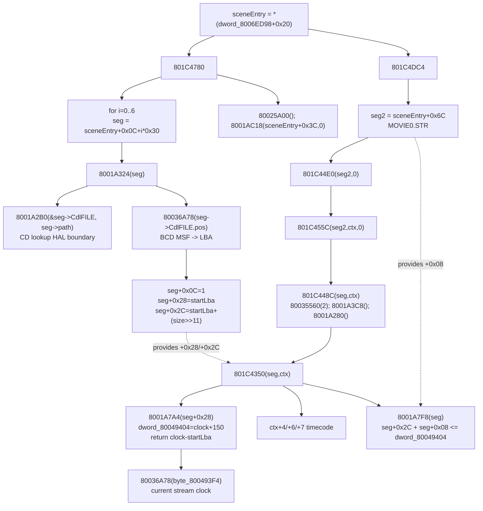

# Movie segment 48-byte record field map

Scope: static整理 only. No build, no test, no `src` edit. This note only records
local game-code porting fields for the movie segment chain around
`8001A324`, `801C4780`, `801C4DC4`, `801C448C`, `801C4350`,
`8001A7A4`, and `8001A7F8`.

## Evidence

- `docs/项目规则.md`: direct-port first, do not infer PSX behavior from Win shell
  state.
- `docs/stage1_decomp/movie1_fast_sprite_rgb_20260510/ida_export_801C448C_801C4350_movie_step_20260510.md`:
  current-IDB export for `801C448C`, `801C4350`, `8001A7A4`,
  `8001A7F8`, and `80036A78`.
- `docs/stage1_decomp/movie1_fast_sprite_rgb_20260510/ida_export_801C455C_movie_text_outer_loop_20260510.md`:
  `801C4DC4` callsite for `sceneEntry+0x6C`.
- `docs/stage1_decomp/fail_prompt_ev4_20260510/ida_export_ev4_table_dispatch_followup.txt`:
  disassembly evidence for `801C4780` seven-record scan.
- `docs/memory.md`: loader segment layout and 2026-05-10 movie segment notes.
- `src/pr/pr_stage1_movie_segment_direct.h/.cpp` and
  `src/pr/pr_stage1_movie_text_outer_loop_direct.h/.cpp`: current direct
  carrier shape, read only.

## 48-byte record layout

The record is a 0x30-byte loader/movie segment row. Use byte offsets below;
where existing pseudo C uses `a1[n]`, that means dword index.

| Offset | Dword | Current name | Producer | Consumer | Direct-port status |
|---:|---:|---|---|---|---|
| `+0x00` | `a1[0]` | `pathPtr` / descriptor-present gate | Static scene loader table | `8001A324` early skip when zero; `8001A2B0` lookup path | Table producer not closed in movie-segment direct |
| `+0x04` | `a1[1]` | `unk04` / row metadata | Static scene loader table | No proven movie-step consumer in this slice | Keep as opaque table field |
| `+0x08` | `a1[2]` | `endBiasA1Plus8` / tail offset | Static scene loader table | `8001A7F8`: `end + endBias <= dword_80049404` | Can feed `segmentEndBiasA1Plus8`; producer not closed |
| `+0x0C` | `a1[3]` | `loaded/state` | `8001A324` writes `1`; static table initial value | `8001A324` early return when already `1` | Direct formula known; 7-entry mutation not wired |
| `+0x10..+0x13` | `a1[4]` | `CdlFILE.pos` / BCD MSF start | `8001A2B0` / CD lookup fills CdlFILE | `80036A78` in `8001A324` | Direct conversion known; lookup producer not closed |
| `+0x14` | `a1[5]` | `CdlFILE.size` bytes | `8001A2B0` / CD lookup fills CdlFILE | `8001A324`: `size >> 11` sector length | Can feed `lengthSourceA1Plus20`; lookup producer not closed |
| `+0x18..+0x27` | `a1[6..9]` | `CdlFILE.name[16]` | `8001A2B0` / CD lookup | Not used by `801C4350`/`8001A7F8` | Opaque for this boundary |
| `+0x28` | `a1[10]` | `startLba` / `timeBaseA1Plus40` | `8001A324`: `80036A78(CdlFILE.pos)` | `801C4350` passes `*(a1+40)` to `8001A7A4` | Ready for `segmentTimeBaseA1Plus40` |
| `+0x2C` | `a1[11]` | `endLba` / `endA1Plus44` | `8001A324`: `startLba + (size >> 11)` | `8001A7F8`: `*(a1+44) + *(a1+8)` | Ready for `segmentEndA1Plus44` |

Notes:

- `+0x28` is both the loader `start_lba` and the movie-step `timeBase` field.
- `+0x2C` is the loader `end_lba` and the movie-end `segmentEnd` field.
- `+0x08` is not produced by `8001A324`; it must come from the static segment
  table or a still-unclosed table producer.

## Function relationships

## Function-by-function field contract

### `8001A324(seg)`

- Early return `0` if `seg[3] == 1` or `seg[0] == 0`.
- Calls `8001A2B0(seg + 0x10, seg->path)` conceptually; existing notes often
  write this as `a1 + 4` because the pseudo C argument is dword-indexed.
- If lookup fails, returns `-1`.
- On success:
  - `seg+0x28 = 80036A78(seg+0x10)`
  - `seg+0x0C = 1`
  - `seg+0x2C = seg+0x28 + (*(u32 *)(seg+0x14) >> 11)`
  - returns `0`

This is the producer for the two fields consumed later by `801C4350` and
`8001A7F8`.

### `801C4780()`

Disassembly shows the scan:

- Starts at `sceneEntry + 0x0C`.
- Calls `8001A324(sceneEntry + 0x0C + i*0x30)` for `i = 0..6`.
- Then calls `80025A00()`.
- Then calls `8001AC18(sceneEntry + 0x3C, 0)` for `seg1` / COMPO loading.

For movie segment direct, this is the missing table-wide producer pass. It
should eventually apply the `8001A324` mutation to all seven rows before
`801C4DC4` consumes `seg2` and `seg3`.

### `801C4DC4(...)`

Current corrected segment selection:

- Opening STR segment: `*(dword_8006ED98 + 0x20) + 0x6C`, i.e.
  `sceneEntry + 0x6C` / loader `seg2`.
- This is not a bare immediate `108`; the base is the current scene entry.
- The title/menu STR path later goes through `sceneEntry + 0x9C` / loader
  `seg3` via `801C4894`.

### `801C448C(seg, ctx)`

Thin wrapper only:

- `80035560(2)`
- `8001A3C8()`
- `8001A280()`
- tail-calls `801C4350(seg, ctx)`

Do not use Win-side `strPlayed` or similar shell state to replace this.

### `801C4350(seg, ctx)`

- Calls `8001A7A4(*(seg+0x28))`.
- If returned counter is negative, returns `1`.
- Filters large jumps against `dword_801C954C` with threshold `301`; large
  forward/backward deltas return `1` without updating ctx timecode.
- Normal path writes:
  - `dword_801C954C = counter`
  - `ctx+0x04 = counter / 5 / 1800`
  - `ctx+0x07 = counter / 5 % 30`
  - `ctx+0x06 = counter / 5 % 1800 / 30`
- Returns `8001A7F8(seg) != 1`.

### `8001A7A4(timeBase)`

- Computes `clock = 80036A78(byte_800493F4)`.
- Writes `dword_80049404 = clock + 150`.
- Returns `clock - timeBase`.

Here `timeBase` is the segment `+0x28` / `a1[10]` value produced by
`8001A324`.

### `8001A7F8(seg)`

- Returns `(*(s32 *)(seg+0x2C) + *(s32 *)(seg+0x08) <= dword_80049404)`.
- The corrected authority is `end + endBias <= dword_80049404`, not the older
  bad simplification `end + endBias <= 0`.

## Fields ready to connect to `pr_stage1_movie_segment_direct`

| Direct carrier/API | Field(s) | Why ready | Remaining condition |
|---|---|---|---|
| `kMovieSegmentRecordSize8001A324` | `0x30` stride | Confirmed by scene loader layout and `801C4780` `+0x30` loop | None |
| `kSceneEntryMovieSegmentCount801C4780` | seven rows | `801C4780` loop calls `8001A324` seven times | Need runtime/table pass wiring |
| `kSceneEntryMovieSegmentOffset801C4DC4` | `0x6C` | `801C4DC4` passes `sceneEntry+0x6C` to STR start/loop | Need sceneEntry source at runtime |
| `MsfBcd80036A78` / `PsxCall80036A78_MsfToLba` | BCD `MM:SS:FF -> LBA` | `80036A78` is pure formula | Clock byte producer still separate |
| `PsxCall8001A324_InitSegmentRecord` | `+0x28`, `+0x2C` | Formula is known: `startLba`, `startLba + (size >> 11)` | Needs real `CdlFILE.pos` and `size` source |
| `BuildMovieStepSegmentFields801C4350` | `+0x28`, `+0x2C`, `+0x08` | Exactly matches `801C4350/8001A7F8` inputs | `+0x08` producer must remain explicit |
| `PsxSelectMovieSegment801C4DC4` | `sceneEntry+0x6C` | Corrects bare `108` to scene-relative pointer | Needs current scene entry pointer |

## Producer gaps still not closed

| Gap | Why it is still open | Do not replace with |
|---|---|---|
| Static scene segment table producer | The 48-byte rows exist in scene entry data, but this document does not extract all row initial values or bind them to runtime `MovieSegmentRecord48` instances | Win STR filenames or playback status |
| `801C4780` seven-entry scan wiring | The scan is proven in disassembly, but current `pr_stage1_movie_segment_direct` only has per-record carrier helpers | A one-off `seg2` manual fill |
| `8001A2B0` / CD lookup source | `8001A324` depends on CdlFILE `pos/size` being filled by lookup; lower lookup/HAL is a separate boundary | Host archive guesses without explicit feedback |
| `+0x08 endBias` owner | `8001A324` does not write it; `8001A7F8` consumes it | Treating it as zero unless the row says zero |
| `byte_800493F4` clock producer | `80036A78` formula is closed, but the stream clock bytes are produced by the CD/STR playback side | Win frame counter or `strPlayed` |
| `dword_8006ED98+0x20` sceneEntry producer | `801C4DC4` selection depends on current scene entry base | Hardcoded `108` or global Scene0-only address |
| `seg3 sceneEntry+0x9C` title/menu segment pass | `801C4894` consumes the second STR row after the opening segment; this note only centers the requested address set | Reusing `seg2` state for title STR |

## Cutover implication

The safe next direct-port boundary is not `801C448C` anymore; that wrapper and
`801C4350/8001A7A4/8001A7F8` are locally understood. The remaining authority
is the segment row producer:

1. Materialize the seven `sceneEntry + 0x0C + i*0x30` rows as
   `MovieSegmentRecord48`.
2. Run the `801C4780 -> 8001A324` mutation over those rows.
3. Feed `sceneEntry+0x6C` into `801C4DC4/801C455C` as the opening movie
   segment.
4. Feed `+0x28/+0x2C/+0x08` into
   `MovieTextOuterLoopInputSub801C455C`.
5. Keep gaps explicit if `CdlFILE`, `+0x08`, `byte_800493F4`, or sceneEntry
   base is unknown.

This keeps the Win side as a PSX field carrier and avoids reintroducing
playback-status heuristics.
