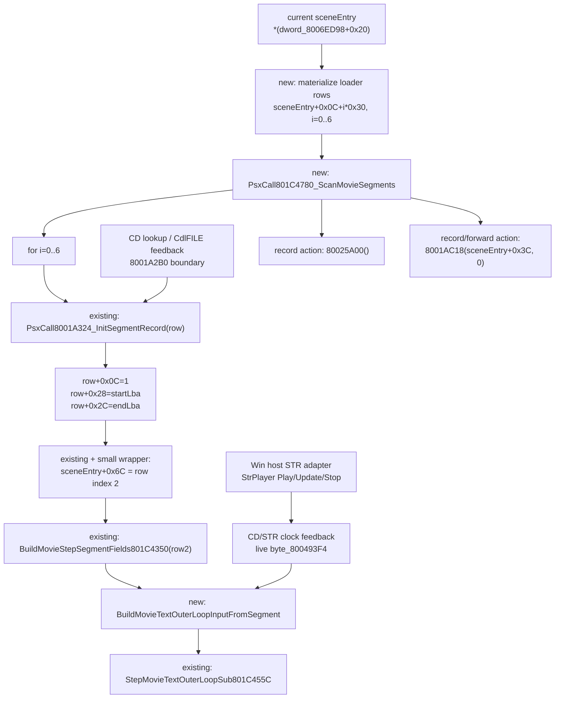

# Movie segment direct next cutover plan

Scope: static核实 + 文档输出 only. No build, no test, no `src` edit.

Goal: define the smallest direct-port boundary that connects the proven
`801C4780` seven-entry loader scan and `sceneEntry+0x6C` movie segment selection
to the current `801C455C` outer-loop direct runtime.

## Static inputs checked

- `docs/项目规则.md`: direct-port 边界应按耦合子图切，不在 Win 壳里继续补
  playback/status heuristics；adapter 只能做类型转换和调用转发。
- `src/pr/pr_stage1_movie_segment_direct.h/.cpp`: already has per-record
  carriers for `0x30` record size, seven-row count, `sceneEntry+0x6C`,
  `80036A78`, `8001A324`, and `801C4350` field extraction.
- `src/pr/pr_stage1_movie_text_outer_loop_direct.h/.cpp`: `801C455C` input can
  already consume `segmentTimeBaseA1Plus40`, `segmentEndA1Plus44`, and
  `segmentEndBiasA1Plus8`; when those fields are known, the loop computes
  `8001A7A4` and `8001A7F8` directly.
- `movie_segment_48_record_fields_20260510.md`: records the `801C4780` scan,
  `sceneEntry+0x6C` selection, and remaining producer gaps.
- `docs/stage1_decomp/fail_prompt_ev4_20260510/ida_export_ev4_table_dispatch_followup.txt`:
  disassembly confirms `801C4780` starts at `sceneEntry+0x0C`, loops seven
  records with stride `0x30`, calls `8001A324`, then calls `80025A00()` and
  `8001AC18(sceneEntry+0x3C, 0)`.
- `docs/stage1_decomp/movie1_fast_sprite_rgb_20260510/ida_export_801C455C_movie_text_outer_loop_20260510.md`:
  `801C4DC4` calls `801C44E0(sceneEntry+0x6C, 0)` and
  `801C455C(sceneEntry+0x6C, &unk_801C3640, 0)`.

## Minimum direct boundary

The next cutover boundary should be:

```text
sceneEntry loader rows
  -> direct materialize 7 x MovieSegmentRecord48
  -> direct 801C4780 scan over all seven rows
  -> select row at sceneEntry+0x6C (row index 2)
  -> build 801C455C segment fields from that row
  -> existing MovieTextOuterLoopInputSub801C455C
```

This boundary is intentionally smaller than a full `801C4DC4` port. It closes
the segment producer/consumer gap without moving STR playback, CD clock
production, transition effects, INT parsing side effects, or Win rendering into
`pr_stage1_movie_segment_direct`.

Do not cut over by filling only `seg2` manually. `801C4780` is a table-wide pass:
even if the immediate `801C455C` consumer uses `sceneEntry+0x6C`, the PSX setup
mutates all seven rows before later code consumes `seg2`, `seg3`, and COMPO.

## Calling graph



## Data structures to add

These belong in the movie segment direct layer or a thin direct-facing carrier.
Names are proposed; exact names can change during implementation if the same
contract is preserved.

| Proposed structure | Purpose | Notes |
|---|---|---|
| `SceneEntryMovieSegmentTable801C4780` | Caller-owned snapshot of the seven `0x30` rows under one scene entry | Holds `sceneEntryBaseKnown`, `sceneEntryBase`, `rows[7]`, row PSX addresses, and per-row known flags. |
| `MovieSegmentScanResult801C4780` | Result of the `801C4780` table pass | Holds mutated rows, per-row `8001A324` result/status, and action flags for `80025A00` and `8001AC18(sceneEntry+0x3C,0)`. |
| `MovieSegmentRowInitFeedback8001A324` | Explicit lower-boundary feedback for one row | Carries `CdlFILE.pos`, `CdlFILE.size`, lookup success/failure, and keeps `+0x08` as table-owned data. Do not source these from STR playback state. |
| `SceneEntryMovieSegmentSelection801C4DC4` | Stronger selection result for `sceneEntry+0x6C` | Extends the existing address-only selection with `rowIndex=2`, `rowKnown`, and copied `MovieSegmentRecord48`. |
| `MovieTextOuterLoopSegmentInput801C455C` | Direct bridge into the existing outer-loop input | Contains only `+0x28`, `+0x2C`, `+0x08`, and optional clock feedback fields needed by `MovieTextOuterLoopInputSub801C455C`. |

Keep `MovieSegmentRecord48` as the canonical row carrier. Do not introduce a
parallel Win-side movie row model with filenames, play state, or derived
duration fields.

## Functions to add

| Proposed function | Minimal contract |
|---|---|
| `MaterializeSceneEntryMovieSegments801C4780(...)` | Convert the parsed/current scene entry loader table into seven `MovieSegmentRecord48` rows. It may copy known table fields, but must leave unknown producers explicit. |
| `ApplyMovieSegmentRowFeedback8001A324(...)` | Attach CD lookup feedback to a row before calling the existing `PsxCall8001A324_InitSegmentRecord(...)`. This is a direct boundary helper, not a Win CD implementation. |
| `PsxCall801C4780_ScanMovieSegments(...)` | Loop `i=0..6`, run `8001A324` semantics on `sceneEntry+0x0C+i*0x30`, then expose `80025A00` and `8001AC18(sceneEntry+0x3C,0)` as actions/gaps. |
| `SelectMovieSegmentFor801C4DC4FromScan(...)` | Select row index `2` / `sceneEntry+0x6C` from the scan result. It should fail open with `known=false` if the scene entry or row is not materialized. |
| `BuildMovieTextOuterLoopInputFromSegment801C455C(...)` | Copy `BuildMovieStepSegmentFields801C4350(row)` into `MovieTextOuterLoopInputSub801C455C`; merge existing host/context inputs without deriving segment fields from them. |

Do not add logic to `801C455C` for row selection. Its direct runtime should stay
focused on the outer loop. The row producer belongs before it, matching the PSX
order `801C4780 -> 801C4DC4 -> 801C455C`.

## Fields that must cross the boundary

| Field | Producer | Consumer | Cutover rule |
|---|---|---|---|
| `row+0x08` / `endBiasA1Plus8` | Static scene segment table | `8001A7F8` via `801C4350` | Preserve from table. Unknown remains unknown; never default to zero unless the row data says zero. |
| `row+0x0C` / loaded state | `8001A324` | `8001A324` re-entry guard | Mutated by scan result, not by host playback. |
| `row+0x10..0x14` / `CdlFILE.pos,size` | `8001A2B0` lookup feedback | `8001A324` | Keep as explicit CD lookup boundary. |
| `row+0x28` / `timeBaseA1Plus40` | `8001A324 -> 80036A78(pos)` | `8001A7A4` | Required for direct `clock - timeBase`. |
| `row+0x2C` / `endA1Plus44` | `8001A324` | `8001A7F8` | Required with `+0x08` and watchdog clock. |
| `byte_800493F4` | CD/STR playback side | `8001A7A4` | Only live bytes are a valid producer boundary. Do not provide an already-computed `80036A78` LBA and do not replace this with Win frame counters. |

## Win host adapters that must not be deleted in this cutover

The next cutover only moves row selection and row field authority. These Win
adapters remain necessary platform/HAL boundaries:

- `BuildStage1Movie1HostFeedback(...)`: still gathers platform facts such as
  `StrPlayer` readiness, STR file existence, language, subtitle enable state,
  current movie frame, and video-finished state. The direct segment code should
  not own those host facts.
- `AdvanceStage1Movie1HostStrPlayer(...)`: still performs the real
  `StrPlayer::Update(...)` call and refreshes host movie-frame/subtitle-frame
  feedback. This is a platform side effect, not PSX row logic.
- `ExecuteStage1Movie1HostActions(...)`: still executes `StopStr`,
  `PlayMovie1Str`, `PauseStr`, SQEVS init/shutdown/update, cue playback, and
  logging. Direct code may emit actions, but the host adapter performs them.
- `AdvanceStage1Movie1DirectFromHostAdapter(...)`: still sequences host
  feedback -> direct runtime -> host actions. The segment cutover should feed
  segment fields into this flow, not bypass it.
- Transition/render adapters around `80020110`, `800201AC`, draw-plan execution,
  and Win render output remain outside this boundary. They are consumer/HAL
  adapters and must not be removed while only `801C4780` segment data is being
  cut over.

Allowed cleanup after this cutover: remove only duplicate Win-side derivations
of `a1+0x28`, `a1+0x2C`, and `a1+0x08` if the scan result becomes their single
source. Do not remove STR host actions, clock feedback plumbing, INT/COMPO
loading actions, or transition/render adapters.

## Implementation order

1. Add the table/scan carrier and `801C4780` scan helper around the existing
   `MovieSegmentRecord48` and `PsxCall8001A324_InitSegmentRecord(...)`.
2. Add a thin scene-entry materializer that can populate all seven rows from
   the current loader table source. Unknown row fields must stay explicit.
3. Select `sceneEntry+0x6C` from the scan result as row index `2`.
4. Build `MovieTextOuterLoopInputSub801C455C` segment fields from that selected
   row by reusing `BuildMovieStepSegmentFields801C4350(...)`.
5. Leave `80025A00`, `8001AC18(sceneEntry+0x3C,0)`, CD lookup, and STR clock as
   explicit actions/gaps until their own direct/HAL boundaries are closed.
6. Only after the above is wired should old Win derivations of segment timing
   fields be removed.

## Non-goals for this cutover

- Do not port the full `801C4DC4` scene/menu flow yet.
- Do not replace `StrPlayer` with direct movie-segment code.
- Do not treat STR completion, `strPlayed`, or Win frame time as authority for
  `+0x28`, `+0x2C`, or `+0x08`.
- Do not collapse `seg2` and `seg3`; `sceneEntry+0x6C` and `sceneEntry+0x9C`
  are distinct rows.
- Do not hide unknown `CdlFILE`, `byte_800493F4`, sceneEntry, or `+0x08`
  producers behind default values.

## Static conclusion

The minimum direct boundary is the producer edge, not another outer-loop patch:
materialize the seven scene-entry loader rows, run the `801C4780` scan semantics
over all rows, select `sceneEntry+0x6C` as row index `2`, and feed only that
row's `+0x28/+0x2C/+0x08` fields into the existing `801C455C` input. The Win
host STR/action adapters remain in place because they own platform side effects
and clock/playback feedback, not PSX segment-row authority.
