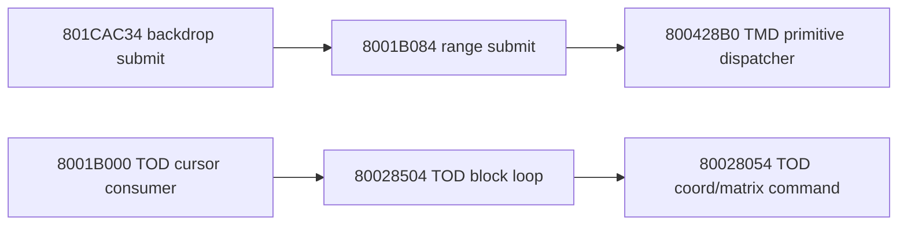

# Stage1 scene-submit incomplete static graph / export gap manifest 2026-05-12

This document is an incomplete graph manifest. It records the current static
boundary and missing exports; it does not authorize deleting backend/router
code or substituting Win-side defaults.

## Authority boundary

- Source of truth: IDA pseudo C and disassembly.
- Existing complete dump: `801CAC34` pseudo C in
  `scene_submit_draw_exports_20260512/decompile_801cac34.txt`.
- Existing full main-SCUS dump: `8001B084`, `800428B0`, `8001B000`,
  `80028504`, and `80028054` in
  `ida_export_scene_submit_static_graph_main_8001b084_800428b0_8001b000_80028504_80028054_20260512.txt`.
  The current-session export reports an empty IDA input path; treat it as
  current IDA UI evidence, not a for-file path-purity artifact.
- Missing before graph can be considered closed: a written side-effect graph
  from the full export, especially the remaining `800428B0` packet side-effect
  boundary. The `801CAC34` standalone disassembly/xref supplement has been
  added in `scene_submit_801cac34_overlay_standalone_disasm_xref_20260515.md`.

## Current graph

## Chain 1: 801CAC34 -> 8001B084 -> 800428B0

`801CAC34` is the Stage1 backdrop submitter. The current pseudo C proves that
it submits scene ranges through `8001B084`, emits the gradient rectangle, and
then emits backdrop FastSprite calls for cloud/mountain/sun and the
`UIRender_Block2` gated face/curtain sprites.

`8001B084` now has full current-session pseudo C, disassembly, xrefs, and
callee table in the main-SCUS export. Existing notes say it iterates a
descriptor count, calls `80041A68(desc+4)`, calls `80040544(stack)`, then calls
`800428B0(desc, otag, 14-depth, 0x1F800000)`.

`800428B0` now has full current-session pseudo C, disassembly, xrefs, and
callee table in the main-SCUS export. Existing notes say it decodes descriptor
header flags, selects a primitive dispatch table by type and mode, and walks
the TMD primitive stream until count is consumed. Treat this as a primitive
dispatcher boundary until the side-effect graph is written; do not expand or
delete Win VRAM/TIM/TMD/D3D HAL from this skeleton.

## Chain 2: 8001B000 -> 80028504 -> 80028054

`8001B000` now has full current-session pseudo C, disassembly, xrefs, and
callee table in the main-SCUS export. Existing notes say it validates
cursor/count, calls `80028504(frame, cursor, coord, 0)`, stores the returned
cursor, and decrements count only when the raw cursor advances.

`80028504` now has full current-session pseudo C, disassembly, xrefs, and
callee table in the main-SCUS export. Existing notes say it waits for
`frame >= cursor+4`, reads block count at `cursor+2`, then loops through
`80028054`.

`80028054` now has full current-session pseudo C, disassembly, xrefs, and
callee table in the main-SCUS export. Existing notes say it decodes TOD command
nibble/flags and mutates target coord/matrix state, including
RotMatrix/TransMatrix and command-mode skips.

Current implementation direction remains: raw cursor/count are authority;
`cursorBlockIndex`, `TodBlock`, and decoded command caches are adapters or
cached views only.

### Written side-effect graph notes from the main-SCUS export

- `8001B000`: validates TOD cursor/count state, calls `80028504`, writes back
  the raw cursor returned by `80028504`, and decrements remaining block count
  only when that raw cursor advances.
- `80028504`: reads the raw block header, waits until the frame/sequence value
  reaches the block trigger, executes exactly the raw command count, and
  advances the command pointer by each command header length.
- `80028054` command type 0: merges descriptor attribute words; current code
  treats the merge as a last-observed side effect, not a packet authority
  source.
- `80028054` command type 1: consumes rotation/scale/translation fields in
  flag order. Additive mode updates persistent per-COORD TRS state and rebuilds
  the matrix from that state. Non-additive mode starts from a per-command
  identity matrix, conditionally applies RotMatrix/ScaleMatrix/TransMatrix by
  flags, and writes only the side effects proven by those flags. `flags == 0`
  still writes the identity matrix; it is not a no-op.
- `80028054` command type 4: copies the raw matrix/translation payload into the
  target COORD.
- The fixed multiply helper now follows the PSX low-32-bit product plus
  negative-rounding-before-`>>12` behavior used by these matrix helpers.
- The Win decoded `TodBlock/TodCommand` cache is no longer used as a fallback
  authority when the raw cursor offset cannot be resolved.

## Do-not-delete boundary

- Do not delete `pr_stage_scene_submit_backend.cpp` or TMD/primitive backend
  router based on this document.
- Do not treat `800428B0` as closed beyond the top-level primitive dispatcher
  boundary.
- Do not use renderer color, default RGB, zero-init, payload presence, or visual
  sampling to authorize FastSprite/primitive packet fields.
- Do not continue code hygiene work around headers/facades for this area until
  the missing exports are closed.

## Next export set

Required IDA artifact / graph work:

- `801CAC34`: standalone disassembly and xref/callee supplement has been added
  in `scene_submit_801cac34_overlay_standalone_disasm_xref_20260515.md`.
- Translate the main-SCUS export into a written side-effect graph for
  `8001B084/800428B0/8001B000/80028504/80028054`; keep `800428B0` as a
  primitive dispatcher boundary until its packet side effects are proven.
